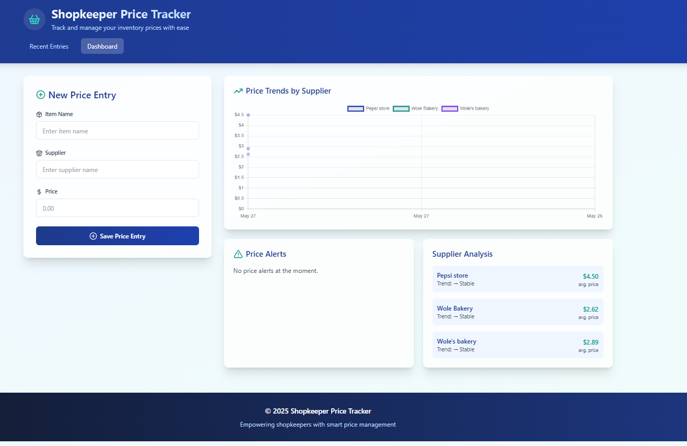

# Shopkeeper Price Tracker

A modern web application that helps shopkeepers track and manage their inventory prices efficiently.



## Features

- 🏪 Easy price entry with item name, supplier, and price
- 📊 Real-time price tracking table
- 📱 Responsive design for all devices

## Tech Stack

- React + TypeScript
- Tailwind CSS for styling
- Supabase for authentication and database
- Vite for development and building

## Getting Started

1. Clone the repository
2. Install dependencies:
   ```bash
   npm install
   ```
3. Set up your Supabase project and add environment variables:
   ```
   VITE_SUPABASE_URL=your_supabase_url
   VITE_SUPABASE_ANON_KEY=your_supabase_anon_key
   ```
4. Run the development server:
   ```bash
   npm run dev
   ```

## Screenshots

### Main Interface


### Price Entry Form


### Recent Entries Table


## Demo Video Script

### Introduction (15 seconds)
"Welcome to Shopkeeper Price Tracker, a modern solution for managing inventory prices efficiently."

### Problem Statement (20 seconds)
"Small business owners often struggle to keep track of their inventory prices across different suppliers. Manual tracking is time-consuming and prone to errors."

### Solution Demo (45 seconds)
1. "Let me show you how easy it is to use our application."
2. "Enter the item details: name, supplier, and price."
3. "View your recent entries in this clean, organized table."

### Features Highlight (20 seconds)
"Our application offers:
- Simple, intuitive interface
- Real-time updates
- Mobile responsiveness"

### Closing (10 seconds)
"Start tracking your inventory prices more efficiently today with Shopkeeper Price Tracker."

[🚀 Live Demo](https://zp1v56uxy8rdx5ypatb0ockcb9tr6a-oci3--5173--55edb8f4.local-credentialless.webcontainer-api.io/)

[💻 GitHub Code](https://github.com/oluwoleowoeye/shopkeeper-price-tracker)

